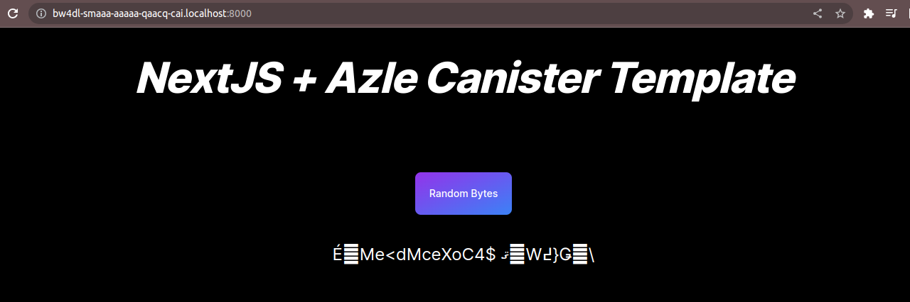

# Bitcoin Real Assets Marketplace (BRAM)

## Tagline
Transforming Payments: Bridging Real Assets to Bitcoin with ck-BTC

## Description
BRAM is a groundbreaking project dedicated to revolutionizing payments by introducing point-of-sale systems to the Bitcoin network. Positioned within the realm of RWA (Real World Assets) DeFi protocols, BRAM leads the way as an innovative force. Through the use of HTTP outcalls, BRAM seamlessly acquires real-world asset data and brings them onto the Bitcoin blockchain by tokenization. Our primary goal is to support projects in the process of tokenizing new assets, making them accessible to a global audience.

### Addressing Real-World Challenges
BRAM confronts several significant challenges within the blockchain and DeFi space:

1. **Real-Asset Integration**: Traditional blockchain networks often face difficulties integrating real-world data, constraining their capabilities. BRAM addresses this issue by bridging the divide between the digital and physical realms. We use HTTP outcalls to securely access and incorporate real-world asset data directly onto the Bitcoin blockchain.

2. **Low-Cost, Low-Latency Payments**: Many existing payment systems on various blockchains suffer from high transaction fees and delays. BRAM introduces ck-BTC, a smart contract-controlled 1:1 Bitcoin-backed IC-native token. This innovation enables low-latency payment solutions with transaction fees that are merely a fraction of a cent, making microtransactions practical and cost-effective.

3. **Ecosystem Expansion**: BRAM is not an isolated solution but an integral component of the expanding IC native tools and services ecosystem. By adopting ck-BTC, developers can effortlessly integrate with this ecosystem, unlocking new opportunities for physical and virtual commerce.

### The Future of BRAM
The future of BRAM is filled with promise. We envision a world where:

- **Widespread Adoption**: BRAM will pave the way for the widespread adoption of Bitcoin in everyday transactions. Whether you're purchasing a cup of coffee at your local café or shopping online, BRAM's low-latency payment solutions will make using Bitcoin as convenient as any other payment method.

- **Real Asset Tokenization**: BRAM will utilize HTTP outcalls to fetch real asset data and tokenize them on the Bitcoin blockchain. This will lead to the tokenization of a wide array of real-world assets, creating new investment opportunities and unlocking liquidity in previously illiquid markets.

- **Innovative Use Cases**: As developers continue to explore BRAM's capabilities, we anticipate the emergence of innovative use cases beyond payments. From decentralized finance applications to supply chain solutions, BRAM's potential applications are boundless.

BRAM is not just a project; it's a vision for a future where blockchain technology seamlessly integrates with the real world, making financial transactions more efficient and accessible for everyone. Join us on this exciting journey as we reshape the landscape of payments and blockchain technology.
---

## Prerequisites

- dfx > 0.15.0-ext.0
- Nodejs >= 18.16.0
- yarn
- jq (Command line based JSON processor).
- To install jq run:

    `sudo apt update && sudo apt install -y jq`

Follwing are the steps to deploy your application locally

1. Install dependencies:

    `yarn && cd azle/ && yarn && cd ..`

2. Run below commands:

    ``` sh -ci "$(curl -fsSL https://internetcomputer.org/install.sh)" ```
    
    Then export its path

   ```
   export PATH="$PATH:/home/einstein/bin"
   ```
   
   ```dfx start --clean --background```

   `bash scripts/deploy_frontend_canister.sh  local`

- To Stop Replica run:

   ```dfx stop```

   
